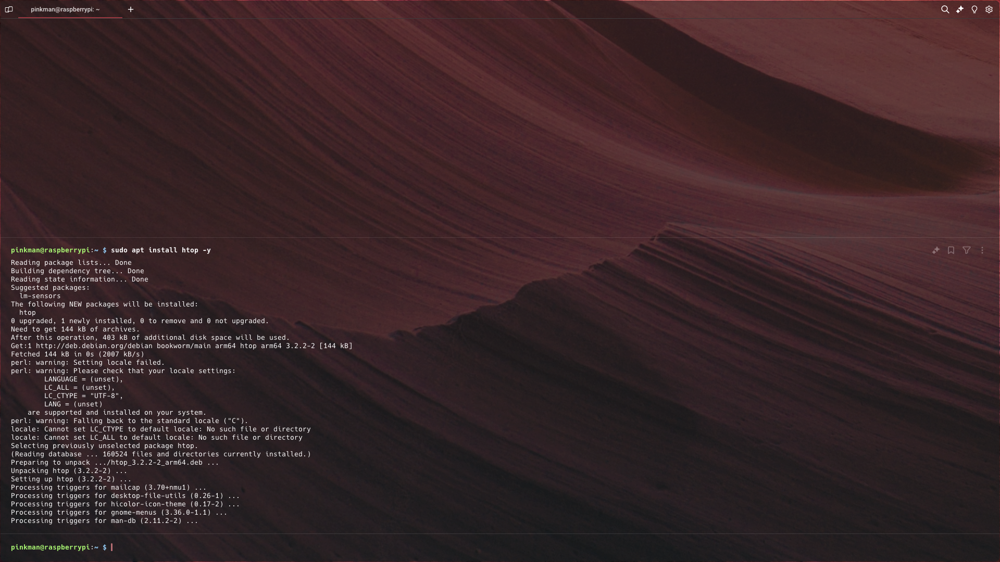

# Raportti "Komentaja Pingviini"
Tässä raportissa käydään läpi hieman Linuxin perus komentoja ja erilaisia komentoriville asennettavia ohjelmia.

### Micron asentaminen
1. Ensiksi päivitin apt lähteet komennolla: `sudo apt update`
    
2. Tämän jälkeen asensin kaikki päivitykset: `sudo apt full-upgrade -y`
    
3. Tämän jälkeen asensin micro ohjelman komennolla `sudo apt install micro` ja painoin enter
    
4. Tämän jälkeen perustin testausta varten uuden tiedoston nimeltään `test.txt` ja lisäsin sinne tekstiä
    
    
5. Tämän jälkeen törmäsin ongelmaan, koska en osannut sulkea ohjelmaa. Lopulta löysin kuitenkin ratkaisun ohjelmiston "help" osiosta.
    
6. Help osion sain auki ctrl + g ja siellä on ohjeet miten saa micron komentorivin auki `ctrl + e`. Päätin kokeilla komentoriville `quit` komentoa, joka sulki ohjelman.
    

## Kolmen komentoriviohjelman esittely
Tässä kappaleessa esitellään kolmea yksinkertaista ohjelmaa, jotka löytyivät "apt search" komennon avulla.

### htop
`htop` on kehittyneempi versio `top` komennosta. `htop` komennon avulla pystyt näkemään kaikki järjestelmän prosessit, niiden taustatiedot ja pystyt myös yleisellä tasolla 
hallitsemaan niitä. `htop` komento on hyvä, koska se myös näyttää reaaliajassa paljonko resursseja jokin prosessi käyttää ja paljonko järjestelmällä on kuormitusta.

1. Asensin htop ohjelman komennolla `sudo apt install htop -y`
    
2. Ohjelma asentui ilman mitään ongelmia.
    
3. Ohejlmasta löytyy myös parametrit, jolla voit suodattaa prosesseja käyttäjäkohtaisesti tai nimen perusteella.
    
    

### SL
`sl` on pila ohjelma, joka yrittää matkia ls komentoa. Pila esiinty siinä, kun käyttäjä kirjoittaa vahingossa ls komennon väärin ja ruudulle pamahtaa ohi kulkeva juna, jota ei voi sulkea millään, ei edes `ctrl + c` yhdistelmällä.

1. Asensin `sl` ohjelman komennolla `sudo apt install sl -y`
    
2. Ajoin komennon ja näytölle ilmestyi ohi kulkeva juna.
    

### duf
`duf` on hieman käyttäjäystävällisempi versio komennosta `df`. Duf on hyvin yksinkertainen työkalu, joka näyttää paljonko muistia on käytössä/vapaana järjestelmässä.

1. Asensin duf ohjelman komennolla `sudo apt install duf -y`
    
2. Testasin ohjelmaa ajamalla komennon `duf` ja kaikki näytti toimivan.
    

## FHS.

1. "/" on juuri kansio
2. /home/ on kansio

## Grep komento
Grep on komento, jonka avulla voi etsiä ja suodattaa tekstiä. Grep komennon avulla voi etisä tekstitiedostosta tietyn tekstin tai sitä voi myös käyttää putkessa.

### Esimerkkejä Grep komennosta:
#### Miten löydän etsimäni sanan tekstitiedostosta?

1. Käytetään esimerkkinä mun luomaa tesktitiedostoa `testi.txt`, jossa on paljon tekstiä ja piilossa on sana `piilossa`.
    
    
2. Syöttämällä komennon `grep "piilossa" testi.txt` grep komento palauttaa tekstirivin, josta löytyy kyseinen sana.
    
3. Grep ohjelmasta löytyy myös parametri `--color`, joka värittää kyseisen sanan löydetyltä riviltä
    

### Miten etsin sanaa rukursiivisesti? (kaikista kansion tiedostoista)

Prosessi on käytännössä sama kuin edellisessä esimerkissä, mutta `grep --color "piilossa" testi.txt` komennon sijasta käytettäisiin `grep --color -r "piilossa" ./` komentoa.
    

### Miten etsin kuinka monta kertaa jokin sana esiintyy tiedostossa?

Komento on käytännössä edelleen sama kuin edellisessä esimerkissä, mutta `grep --color 'piilossa' testi.txt` komennon sijasta käytettäisiin `grep -c "piilossa" testi.txt` komentoa. Tässä parametri `-c` tarkoittaa "count", eli grep etsii kuinka monta kertaa kyseinen sana esiintyy `testi.txt`.
    

## Pipe esittely
Pipe on komentorivillä käytetty keino, jonka ansiosta voit syöttää suorittamasi komennon tuloksen toiselle komennolle, eli toisin sanoen ketjuttaa komentoja. Hyvin yleinen koneto jota käytetään putkessa on `less`. Kyseinen komento ottaa tuloksen sitä edellisestä komennosta ja näyttää tulokset sivu kerrallaan, jotta käyttäjän olisi helpompi lukea tulosta. `less` komentoa käyttämällä voi nuoli näppäimillä vierittää sivua ylös/alas ja vasemmalta oikealle yms. Alla esimerkki, jossa tarkistetaan kaikki paketit joihin on saatavilla päivityksiä ja komennon tulos ketjutetaan `less`komennolle.
    
    

Tällä kertaa päivitettäviä paketteja ei ollut kovin monta, joten edellisen komennon tulos jäi lyhyeeksi ja sen olisi voinut peräti jättää ketjuttamatta.`less`komento on tosiaan hyödyllinen pitkien tekstien lukemiseen.
 

## Rauta (lshw)
1. Ensiksi asensin ohjelman komennolla `sudo apt install lshw -y`
    
2. Tämän jälkeen testasin ohjelmaa ajamalla komennon `sudo lshw -short -sanitize`
    
Komento listasi minulle suuren määrän tietoa fyysisestä laitteestani. Tuloksessa näkyy 4 erilaista saraketta: `H/W path`, `Device`, `Class`ja `Description`. 

    - `H/W path` (hardware path) sarakkeessa oleva tieto kertoo jokaisen komponentin suhteen emolevyyn laitteistohierarkiassa.
    - `Device` sarake kertoo kyseisen laitteen nimen
    - `Class` sarake kertoo kyseisen laitteen luokituksen, eli onko kyseessä esim. kovalevy tai prosessori tms.
    - 'Description' sarake kuvailee hieman enemmän kyseisestä laitetta, jotta käyttäjä ymmärtäisi pikakatsauksella hieman paremmin mistä oikein on kyse.

Oma laite on siis "Raspberry Pi 4 Model B Rev 1.4", kuten ensimmäisellä rivillä näkyy. Laitteelle on asennettu `256GB SD Card` kortti tallennustilaksi. Laitteesta löytyy 2x `vc4-hdmi-1 HDMI Jack` hdmi porttia. Laitteesta löytyy myös `7810MiB System memory` RAM-muistia, eli pyöristettynä n. 8GB RAM-muistia. Kuten kuvasta näkyy, niin komento on muuten todella hyvä, jos haluaa saada pikaisen katsauksen fyysisestä laitteesta, mutta tietoa saattaa myös olla hieman hankala tulkita.

