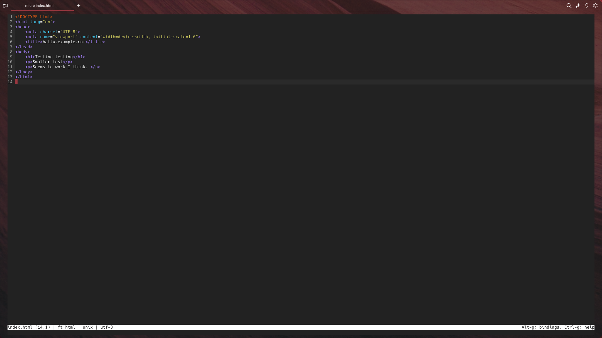

# Harjoitus 3: Hello Web Server
## Tiivistelmä

- Nimiin perustuvien ja IP-osoitteisiin perustuvien virtuaali-isäntien erona on se, että yhdellä IP-osoitteella voi pyörittää monta eri nimiin perustuvaa isäntää, kun taas IP-osoitteisiin perustuvissa isännöinneissä jokaisella isännällä on oma yksilöllinen IP-osoite.
- Jos apache palvelimen nimiin perustuvaa ominaisuutta halutaan testata, niin voidaan määritellä staattisesti `/etc/hosts` tiedostoon ip osoite ja siihen doimain nimi. Tämä tarkoitaa sitä, että linux hakee ensiksi kaikki IP osoitteet kyseisestä tiedostosta ja vasta tämän jälkeen se hakee ne määritellyltä DNS palvelimelta.

## Apache serverin asennus ja testaus

### a) Oletus palvelimen testaus:

Minulla oli jo entuudestaan valmiiksi asennettu apache2 (2.4.62) palvelin. Testasin että palvelimen oletus virtuaali palvelin toimii: 

Web sivu:

### b) Lokitietojen tarkistus
Tarkastin lokitietoja `tail -f` komennon avulla `/var/log/apache2/access.log` ja `/var/log/apache2/error.log` tiedostoista:

`access.log` tiedostosta näkyy selvästi tarkka kellonaika milloin palvelimelle on otettu yhteyttä, käyttäjän ip osoite ja muuta tietoa, kuten mitä on haettu ja mikä on käyttäjän todennäköisin laite/selain. `tail -f` seuraa jatkuvasti tiedostoon tehtyjä päivityksiä ja tämän ansiosta pystyin näkemään livenä kuinka tiedosto päivittyi heti kun latasin sivuston uusiksi selaimellani.

`error.log` tiedostosta taas löytyi tietoa siitä, kuinka yritin käynnistää apache2 palvelinta uusiksi, jotta voisin testata toimiiko palvelimen esimerkki sivusto `000-default.conf`

### c & e) Perustetaan uusi sivusto:
1. Ensiksi tein kopion edellisestä `000-default.conf` tiedostosta ja nimesin sen `hattu.example.conf` tiedostoksi.
    

tiedostson sisältö:

2. Seuraavaksi loin kansion johon lisäsin uuden html5 sivun:
    

3. Loin uuden html 5 sivuston testausta varten ja validoin sen 'w3.org' sivustolta löytyvällä validaattorilla:

Validaattori:

4. Seuraavaksi deaktivoin testaus sivuston komennolla: `sudo a2dissite 000-default.conf` ja aktivoin virtuaali palvelimen komennolla: `sudo a2ensite hattu.example.conf && sudo systemctl restart apache2`. Tämän jälkeen testasin sivuston toiminnallisuuden selaimessa:

### f) Esimerkkejä curl komennosta

`curl` on komentorivillä käytettävä työkalu, jonka ansiosta voidaan hakea tai siirtää tietoa eri palvelimien välillä, käyttäen erilaisia protokollia, kuten tunnettu `http` ja `ftp` protokollan avulla. `curl -I` parametrin avulla taas voidaan hakea pelkästään jonkin kutsun otsakkeet.

Esimerkki `curl https://www.google.com` komennosta:

Komento hakee `https`protokollaa hyödyntäen googlen pääsivun ja tulostaa sen komentoriville. Toisaalta `curl -I https://www.google.com` komento palauttaa pelkästään kyseisen kutsun otsakkeet, eli esimerkiksi: kutsun statuksen, palvelimen palauttaman tiedon tyypin, kutsun ajoituksen, tietoja kekseistä yms:

# Lähteet:
https://httpd.apache.org/docs/2.4/vhosts/name-based.html

https://terokarvinen.com/2018/04/10/name-based-virtual-hosts-on-apache-multiple-websites-to-single-ip-address/

https://validator.w3.org/
