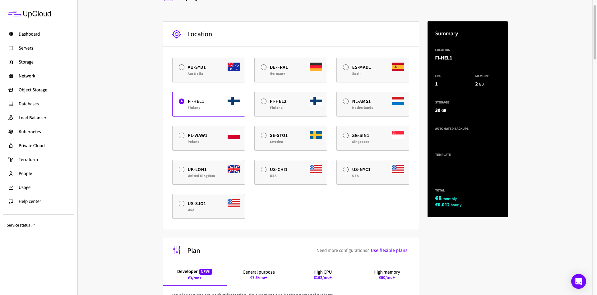

# Maailma kuulee (h4)

### Tiivistelmä

### a) Oman palvelimen vuokraaminen
Vuokrasin palvelimen "UpCloud" nimiseltä palvelintarjoajalta. Vuokrasin palvelimen kyseiseltä tarjoajalta, koska olen vuokrannut myös aikaisemmin palvelimia heidän kauttaan ja palvelimien vuokraaminen on todella helppoa, nopeeta ja halpaa. Minulta löytyi jo valmiiksi käyttäjä, joten ensiksi kirjauduin sisään heidän etusivujen kautta:

Tämän jälkeen selaimeen avautuu kojelauta, jonka oikeasta yläkulmasta löytyy "Deploy" nappi. Sitä klikkaamalla avautuu valikko, josta pystyy valikoimaan mitä haluaa pystyttää. Valitsin sieltä "Server".

1. (Deploy nappi)
    
    
2. (Valikko)
    

Seuraavaksi selaimeen ilmestyy valikko, josta pitää valita palvelimen sijainti, palvelimen teho, kovalevyn tila, automaattiset varakopiot, palvelimen käyttöjärjestelmä, verkkoasetukset, sisäänkirjautumis asetukset, käynnistys scriptit ja palvelimen nimi yms.

1. (sijainti) Koska itse asun suomessa ja tarkoituksena on luoda itselle henkilökohtaien palvelin, niin valitsin palvelimen sijainniksi "FI-HEL1". Valikosta löytyy myös "FI-HEL2", mutta tässä tapauksessa sillä ei ole merkitystä kumman valitsee. Molemmat vaihtoehdot ovat saman hintaisia ja molemmat sijaitsevat kuitenkin Helsingissä.
    

2. (palvelimen teho) Seuraavassa valikossa pystyy määrittelemään palvelimelle tehon. Palvelimen tehon määrittämiseksi voi käyttää jo olemassa olevia pohjia tai valita "Use flexible plans" vaihtoehdon, jolloin pystyy itse täysin räätälöimään omaan käyttötarkoitukseen palvelimen, mutta se myös maksaa huomattavsti enemmän kuin valmiit paketit. Itse päädyin valitsemaan listasta kolmannen vaihtoehdon, jossa on: 1 core, 2 GB RAM ja 30 GB HDD. Hinta tälle on 8€ kuukaudessa. Valikossa myös näkyy "Developer", "General purpose" "High CPU" ja "High memroy" valikot, joista näkyy nimen perusteella myös valmiit paketit eri käyttötapauksille.
    

3. (kovalevyn tila) Seuraava valikko on jo täytetty automaattisesti, jos edellisestä valikosta on valinnut jonkun valmiista paketeista (valitsemani paketti sisälsi 30 GB tallennustilaa), mutta palvelimelle voi myös itse lisätä lisää eri kiintolevyjä jos tarve vaatii. Itse kuiteknin muutin valikosta vielä "Not encrypted" tilaan "Encrypted", eli kovalevy salataan samalla kun palvelin luodaan. 
    

4. (automaattiset varakopiot) Seuraavassa askeleessa voi aktivoida automaattisen varakopioinnin ominaisuuden, mikäli sellaiselle on tarvetta (tämä on hyvin suotavaa tuotannossa), mutta tässä tapauksessa jätin ominaisuuden pois päältä.
    

5. (palvelimen käyttöjärjestelmä) Seuraavassa valikossa pystyy valitsemaan palvelimella ajettavan käyttöjärjestelmän. Valikosta pystyy valita jo olemassa olevia käyttöjärjestelmiä tai myös ladata oman haluamansa käyttöjärjestelmä iso tiedoston. Itse valitsin "Debian GNU//Linux 12" vaihtoehdoksi.
     

6. (verkkoasetukset) Seuraavassa valikossa pystyy määrittämään palvelimelle tarvittavat verkkoasetukset, mikäli tarve vaatii. Itse jätin nämä asetukset oletetuiksi.
    

7. (valinnaiset asetukset) Seuraavaksi pystyy määritellä jotakin valinnaisia asetuksia, mutta itse jätin nämä oletetuiksi.
    

8. (sisäänkirjautumis asetukset) Seuraavassa valikossa pystyy määrittelemään palvelimelle sisäänkirajutumis vaihtoehtoja (tässä tapauksessa vain ssh avainparin). Minulla oli jo edellisestä palvelimesta jäänyt avainpari, niin päätin käyttää sitä. Jos kuitenkin haluaa luoda uuden ssh avainparin, niin hyvät ohjeet löytyvät täältä: https://www.ssh.com/academy/ssh/keygen. Käytännössä kyseistä `keygen` komentoa hyödyntäen luodaan uusi julkinen ja salainen avain. Julkinen avain kopioidaan valikkoon, mikä tulee esille "Add new" nappia painamalla.
    

9. (käynnistys scriptit) Palvelimelle on myös mahdollista määritellä erilaisia scriptejä, joita ajetaan kerran palvelinta luodessa. Nämä ovat siis mitä todennäköisemmin bash scriptejä, joiden avulla voidaan esim. luoda uusia oletettuja käyttäjiä, asentaa ohjelmia yms yms. Itse jätin tämän kentän kuitenkin tyhjäksi.
    

10. (palvelimen nimi) Viimeisessä valikossa voi määritellä "Hostname", "Server name" ja kuinka monta kyseistä palvelin instanssia haluaa käynnistää. Tässä tapauksessa "Hostname" on nimi, joka näkyy sisäisen verkon laitteille, eli jos kyseisen palvelintarjoajan alustalle haluaisi tehdä oman "Private Cloud" ympäristön, niin tämä saattaisi olla oleellinen, mutta tässä tapauksessa jätin nimen oletetuksi. "Server name" on nimi, joka näkyy ulkoverkkoon. Tämä siis näkyy itse UpCloud ympäristössä ja jota esimerkiksi Apache ja muut palvelimet käyttävät. Itse päätin nimetä palvelimen "Michelle" nimiseksi ja palvelimia vain yksi. Tämän jälkeen klikkasin "Deploy" nappia ja odotin noin 5-10 minuuttia, että palvelin asentuisi ja käynnistyisi.
    

11. Lopulta sain palvelimen pyörimään ja testasin palvelimen ssh yhteyden. Kaikki pelitti niinkuin pitikin.
    
    

### b) Alkutoimet

Seuraavaksi palvelimen asennuksen jälkeen tein tarvittavat alkutoimet palvelimelle.

1. Loin uuden "eric" nimisen käyttäjän `useradd` komennolla ja tämän jälkeen lisäsin "eric" käyttäjän sudo ja adm ryhmiin, komennolla `useradd eric sudo && useradd eric adm`. Tämän jälkeen kopioin julkisen ssh avaimen root käyttäjän ".ssh/authorized_keys" tiedoston eric käyttäjän ".ssh" kansioon:
    

2. Tämän jälkeen suljin `exit` komennolla ssh yhteyden ja kokeilin kirjautua uudestaan sisään "eric" käyttäjällä `ssh eric@80.69.173.189` komennon avulla. 
    

3. Tämän jälkeen menin lukitsemaan root käyttäjän komennolla `sudo usermod --lock root`

4. Seuraavaksi päivitin kaikki järjestelmän paketit komennolla: `sudo apt update && sudo apt full-upgrade -y`, jonka jälkeen kävin asentamassa `micro` työkalun. 

5. Tämän kaiken jälkeen kävin muokkaamassa ssh asetuksia "/etc/ssh/sshd_config.d" tiedostossa micron avulla. Kävin vaihtamassa tiedostosta seuraavat asetukset: `Port 44` (on järkevää vaihtaa oletusportti joksikin muuksi tietoturva mielissä), `LoginGraceTime 1m` (tämän asetuksen avulla käyttäjällä on 45 sekunttia aikaa kirjautua sisään, muuten palvelin lopettaa yhteyden) ja `PermitRootLogin no` (tämä määrittää, että root käyttäjällä ei pysty suoraan kirjautumaan sisään ssh:n kautta).

6. Tämän jälkeen käynnistin ssh palvelimen uudestaan komennolla: `sudo systemctl restart ssh` ja kirjauduin uudestaan palvelimelle ssh:n kautta.

7. Asensin palvelimelle `ufw` palomuuri ohjelman ja määrittelin sinne seuraavat port säännöt: 
    

### c) Apache palvelimen pyöritys

1. Asensin apache2 palvelimen komennolla: `sudo apt install apache2`
2. Tämän jälkeen tein uuden apache konfiguraatio tiedoston (test.conf):
    
3. Seuraavaksi aktivoin sivuston `sudo a2ensite test.conf` ja poistin oletus sivuston pois käytöstä `sudo a2dissite 000-default.conf` komennon avulla.
4. Tämän jälkeen lisäsin eric kotihakemistoon uuden kansion nimeltä "publicPages" ja loin sinne "index.html" nimisen tiedoston: 
    
5. Lisäsin vielä tämän jälkeen kyseisellä kansiolle "www-data" groupin `sudo chown eric:www-data ./publicPages` komennon avulla, joka on apachen käyttämä group. Yritin avata tämän jälkeen sivustoa, mutta jostakin syystä apache herjäsi "403 forbidden" erroria. Hetken kuluttua selvisi, että minun "eric" kotihakemistosta puuttui muille käyttäjille ajo oikeudet.
6. Lisäsin niin "eric" kotihakemistolle, kuin myös "/home/eric/publicPages" hakemistolle ajo oikeudet kaikille käyttäjille `sudo chmod 711 /home/eric && sudo chmod 711 /home/eric/publicPages` komennon avulla, jotta apahce pääsisi avamaan kansiot. Tämän jälkeen sivusto näkyi normaalisti:
    

### Lähteet
https://upcloud.com/

https://terokarvinen.com/2017first-steps-on-a-new-virtual-private-server-an-example-on-digitalocean/

https://susannalehto.fi/2022/teoriasta-kaytantoon-pilvipalvelimen-avulla-h4/

https://www.ssh.com/academy/ssh/keygen

https://openai.com/index/gpt-4/