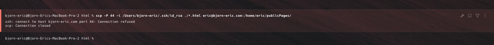

# Harjoitus 6

### a) Omat kotisivut

Näpyttelin paikallisella tietokoneellani kolme hyvin yksinkertaista html sivua, jotka linkitin toisiinsa ja kävin validoimassa https://validator.w3.org/ sivuston avulla: 

1. [index.html (linkki tiedostoon)](./screenshots/h6/html/index.html)
    
    
2.  [page2.html (linkki tiedostoon)](./screenshots/h6/html/index.html)
    
    
3.  [page3.html (linkki tiedostoon)](./screenshots/h6/html/index.html)
     
     

Tämän jälkeen kopioin sivut paikalliselta koneelta palvelimelle `scp`komentoa käyttäen. Yritin kyseistä komentoa käyttäen siirtää tiedostoja omalle palvelimelle, mutta törmästin seuraavaan ongelmaan:
     

Googlailin hetken ja ilmeni, että minulla oli kommentoituna seuraava kenttä ssh konfiguraatio tiedostosta, jonka ansiosta `scp`oli blokattu:
    
 

Käynnistin tämän asetuksen säätämisen jälkeen palvelimen uudestaan ja kokeilin aikaisempaa `scp`komentoa uusiksi, mutta kävi edelleen sama virhe. Lopulta tajusin, että virhe olikin vain käyttäjässä ja oma domain ei ollut `bjorn-eric.com`, vaan `bjorn-eric.me`. Kokeilin uudestaan oikealla domainilla ja tällä kertaa tiedostojen lataaminen onnistui. Tarkastin vielä palvelimelta, että kyseiset tiedostot olivat tallella.
 
 

### b) Nimen konfigurointi

En valitettavasti ymmärtänyt tehtävänantoa. Oliko tarkoitus luoda uusi alidomaini osoittamaan omalle paiaklliselle koneelle vai osoittamaan palvelimelleni?

Hankin oman domainini https://bjorn-eric.com sivustolta https://joker.com. Domainille on konfiguroitu tällä hetkellä kaksi recordia. Yksi A recordi, joka osoittaa palvelimelle ja yksi CNAME recordi, joka uudelleen ohjaa `bjorn-eric.me` osoitteeseen:

Loin kuiteknin uuden A-recodin ja ohjasin myös siihen uudestaan myös CNAME-recordin:

1. A-record:
    
2. CNAME-record:
    
3. Lopputulos:
    

Testasin vielä, että CNAME osoittaa oikeaseen osoitteeseen https://dnschecker.org sivuston avulla ja kaikki näytti kuin piti: 
    
    
    
    
### c) SSH avainparin luonti ja käyttöönotto

Palvelimeltani löytyi jo tehtävääni tehdessä julkinen ssh avain, mutta päätin tehdä uuden avainparin `ssh-keuygen` komennon avulla.

1. Ensiksi ajoin komennon `ssh-keygen -t rsa -b 4096 -C "testi_avain" -f ~/.ssh/testi_avain`. Kyseine komento luo uuden `rsa` tyyppisen ssh avainparin, joka on `4096`tavua pitkä ja sille annetaan nimeksi `testi_avain` ja se luodaan tiedostoon `testi_avain`. Kun ajaa kyseisen komennon, niin komento pyytää vielä antamaan salasanan, jota käytettäisiin kyseisen avaimen yhtydessä, mutta itse jätin kentät tyhjiksi, joten salasanaa ei määritelty kyseiselle avaimelle:
    
    (Listan lopusta löytyy `testi_avain` ja `testi_avain.pub`)
    

2. Tämän jälkeen siirsin julkisen avaimen (`testi_avain.pub`) palvelimelleni `ssh-copy-id` komentoa käyttäen, joka automaattisesti siirtää avaimen palvelimelle:
    

3. Tämän jälkeen vielä testasi ottaa yhteyttä palvelimelle ssh yhteyden yli uudella avaimella. Kaikki toimi niinkuin pitikin ja sain yhteyden palvelimelle: 
    
    
    
### d)

### Lähteet
https://terokarvinen.com/linux-palvelimet/#h5-nimekas 
https://dnschecker.org/