# Hello Django

### Ympäristö
Tein tämän tehtävän Mac Book Pro 16 M1 Max 2021 koneella:

### a) Django kehitys projekti
Aloitin tämän tehtävän lukemalla Tero Karvisen artikkelin: https://terokarvinen.com/2022/django-instant-crm-tutorial/

Koska artikeli oli suunnattu Linux ympäristöä käyttäen, jouduin hieman soveltamaan kyseisen artikkelin ohjeita. `apt-get` komennon sijasta jouduin käyttämään Home Brewn paketinhallinta järjestelmää, eli `brew` komentoa, joka minulta löytyikin näppärästi jo koneelta.

Ensiksi tartkistin oman python 3 version koneelta ajamalla komennon: `python3 --version`.  Sain vastaukseski: `Python 3.10.14`, eli koneellani oli asennettuna riittävän uusin versio Pythonista. Tämän jälkeen tarkistin `pip` version komennolla `pip --version`. Sain vastaukseski: `pip 24.2 from /opt/homebrew/lib/python3.10/site-packages/pip (python 3.10)`. Tämän jälkeen vielä tarkistin löytyisikö minulta jo sattumalta esi asennettu `virtualenv` ohjelma ajamalla komennon: `virtualenv --version` ja sain vastaukseksi: `virtualenv 20.25.0 from /opt/homebrew/lib/python3.10/site-packages/virtualenv/__init__.py`, eli ohjelma löytyi jo myös kätevästi asennettuna koneeltani. Päätin vielä varmuuden vuoksi päivittää homebrewn paketit komennolla: `brew update && brew upgrade`, mutta edellä mainituista paketeista ei ollut uudempaa versioota saatavilla.

Kaiken tämän jälkeen aloin suorittamaan tehtävää edellä mainitun Tero Karvisen artikkelin mukaan. Ajoin ensiksi komennon: `virtualenv ~/django_excercise`, joka loi minulle uuden virtuaali ympäristön `~/django_excercise` hakemistoon. Tämän jälkeen ajoin komennon: `source ~/django_exercise/bin/activate`, jotta pystyisin ottamaan äskettäin luodun virtuaaliympäristön käyttöön. Tämän jälkeen ajoin komennon: `touch requirements.txt && echo "django" > requirements.txt`. Tämä loi uuden tiedoston nimeltään `requirements.txt` ja syötti sinne tekstiä `django`. Tähän kyseiseen tiedostoon voi listata kaikki asennettavat python paketit ja paketit voi tämän jälkeen asentaa komennolla: `pip install -r requirements.txt`. `pip` asensi viimeisimmän django paketin ja tarkisitn sen vielä komennolla: `django-admin --version`, jonka vastaukseksi sain: `5.1.1`. Tämän jälkeen ajoin komennon: `django-admin startproject app`, joka loi minulle uuden `app` nimisen django projektin. Tämän jälkeen käynnistin kehitysympäristön palvelimen komennolla: `./manage.py runserver`. Ympäristö lähti käyntiin moitteettomasti:
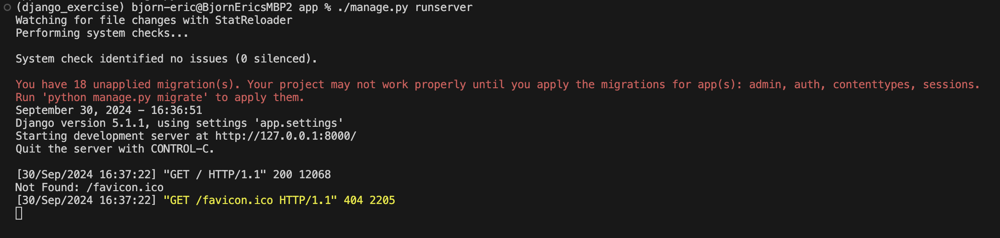
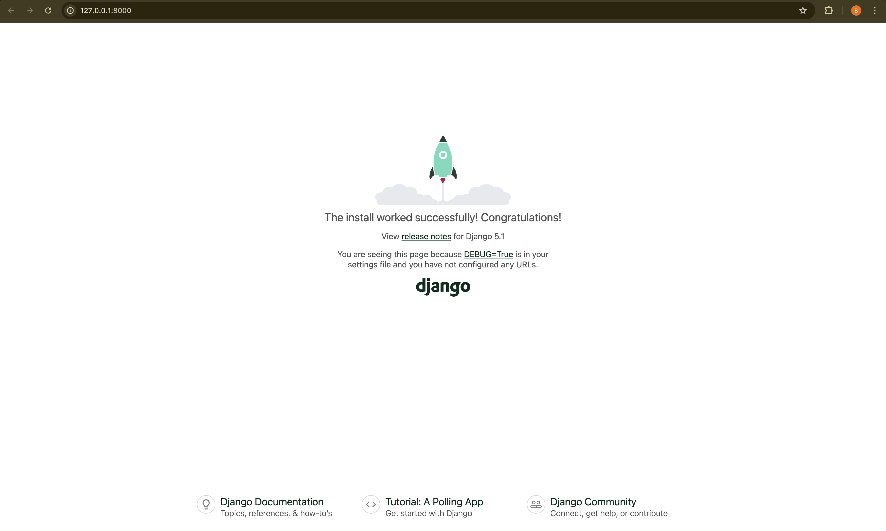

Tämän jälkeen lähdin asentamaan Djangon admin konsolia. Ajoin komennon `./manage.py makemigrations && ./manage.py migrate`:
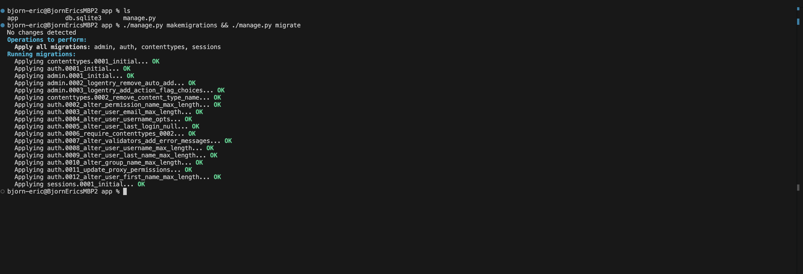

Tämän jälkeen loin uuden admin käyttäjän komennolla `./manage.py createsuperuser`:
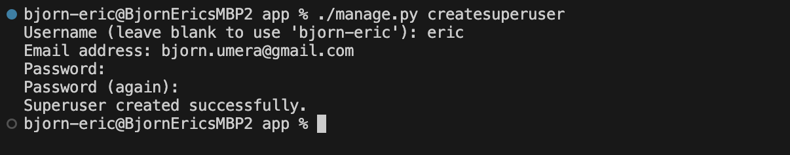

Kokeilin sitten äskettäin luotuja tunnuksia. Pääsin kirjautumaan onnistuneesti ja kaikki näytti toimivan:
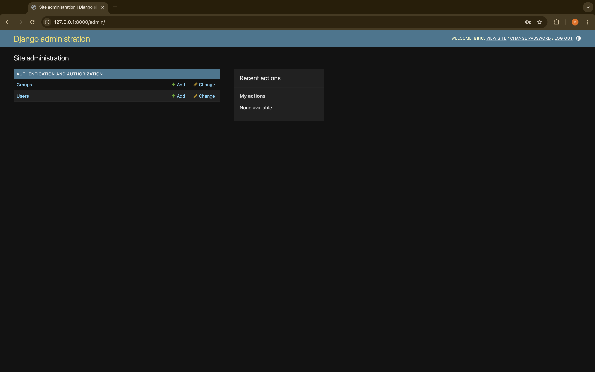
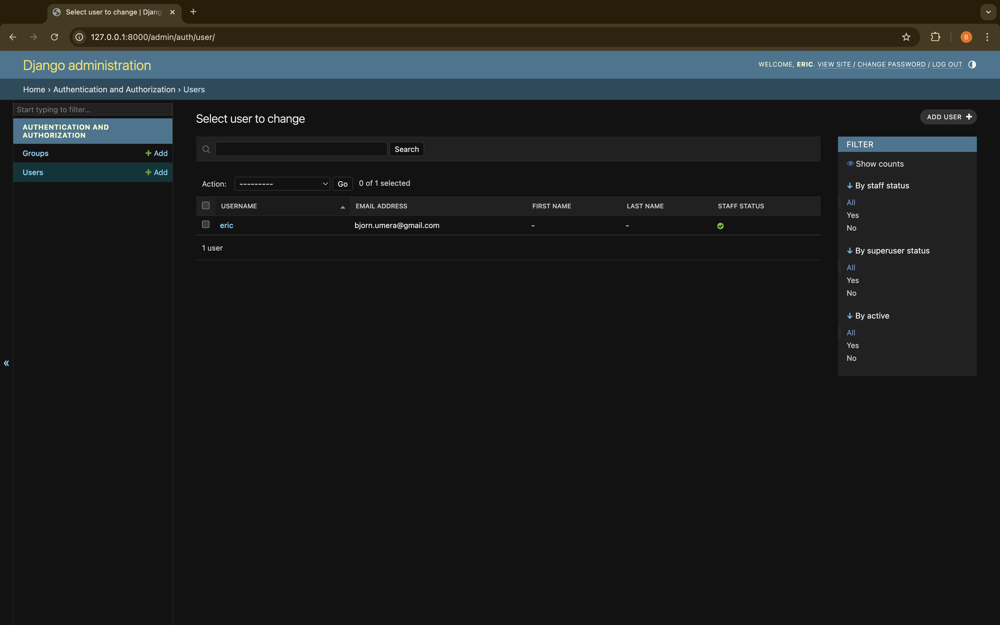

### CRM

Tämän jälkeen suoritin Tero Karvisen ohjeiden mukaan komennon: `./manage.py startapp crm`, joka loi minulle uuden projekti kansion nimeltä `crm`. Lisäsin sen jälkeen `/app/settings.py` tiedostoon seuraavan `crm` parametrin: 
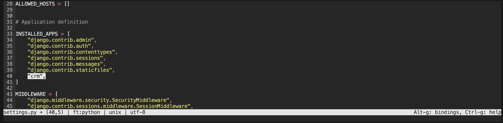

Tämän jälkeen tein uuden asiakas mallin `/app/crm/model.py` tiedostoon, joka loi uuden asiakas formin.
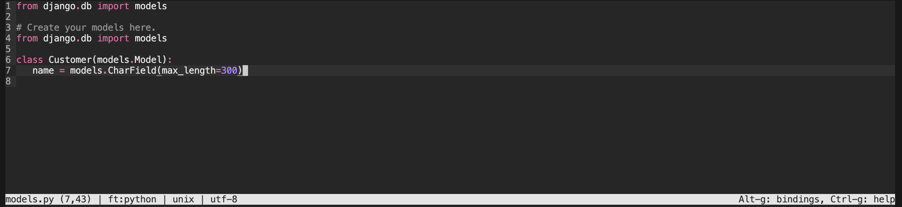

Tämän jälkeen ajoin komennon: `./manage.py makemigrations && ./manage.py migrate`
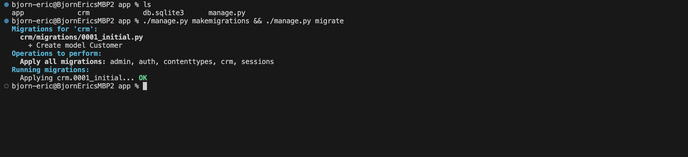

Tämän jälkeen ajoin komennon: `micro crm/admin.py` ja lisäsin sinne `
from django.contrib import admin
from . import models

admin.site.register(models.Customer)
` koodinpätkän, joka rekisteröi äskettäin luomani mallin.
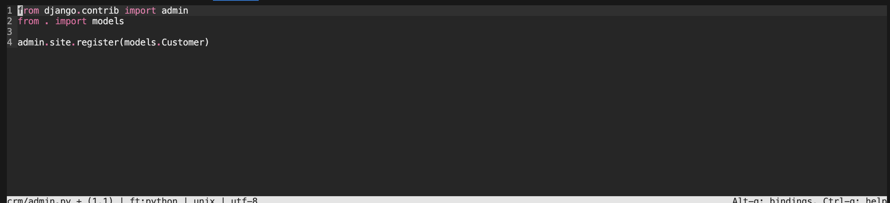

Tämän jälkeen käynnistin palvelimen uudestaan komennolla: `./manage.py runserver` ja testasin näkyikö äskettäin tekemäni malli:
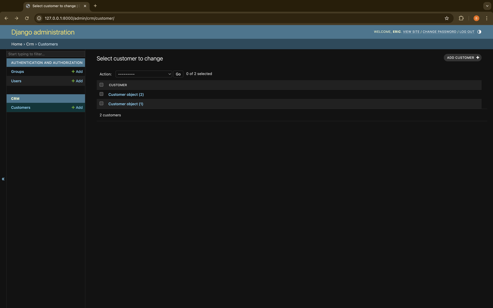

Tämän jälkeen kokeilin vielä ohjeiden mukaan, joko saisin pelkät asiakas nimet näkyviin riveille:
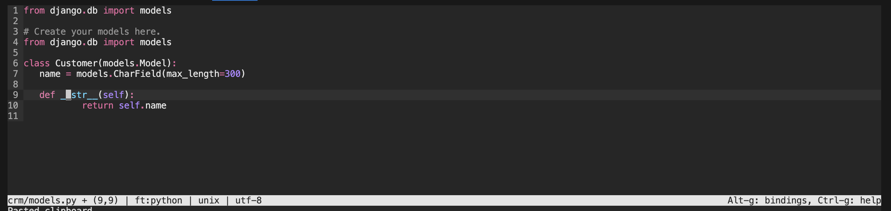
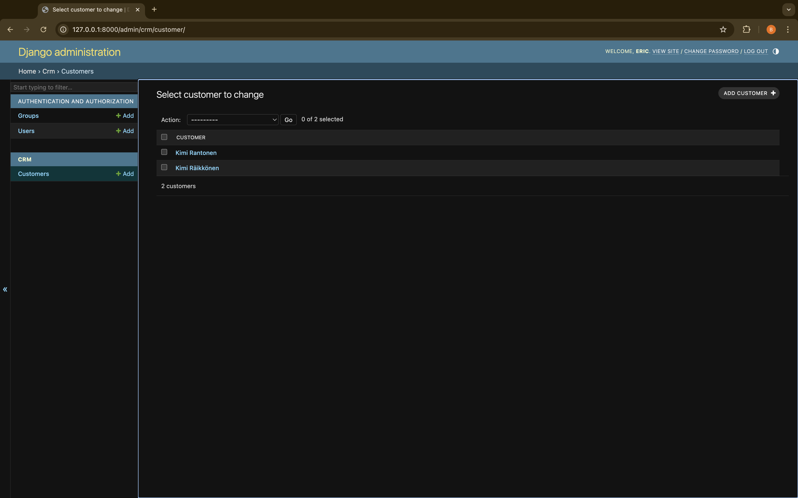

### b) Django tuotanto palvelin

### Lähteet
https://terokarvinen.com/2022/django-instant-crm-tutorial/

https://www.w3schools.com/django/django_getstarted.php

https://brew.sh/