# Hello Django

### Ympäristö
Tein tämän tehtävän Mac Book Pro 16 M1 Max 2021 koneella:
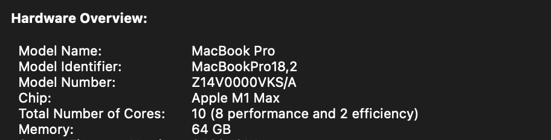

### a) Django kehitys projekti
Aloitin tämän tehtävän lukemalla Tero Karvisen artikkelin: https://terokarvinen.com/2022/django-instant-crm-tutorial/

Koska artikeli oli suunnattu Linux ympäristöä käyttäen, jouduin hieman soveltamaan kyseisen artikkelin ohjeita. `apt-get` komennon sijasta jouduin käyttämään Home Brewn paketinhallinta järjestelmää, eli `brew` komentoa, joka minulta löytyikin näppärästi jo koneelta.

Ensiksi tartkistin oman python 3 version koneelta ajamalla komennon: `python3 --version`.  Sain vastaukseski: `Python 3.10.14`, eli koneellani oli asennettuna riittävän uusin versio Pythonista. Tämän jälkeen tarkistin `pip` version komennolla `pip --version`. Sain vastaukseski: `pip 24.2 from /opt/homebrew/lib/python3.10/site-packages/pip (python 3.10)`. Tämän jälkeen vielä tarkistin löytyisikö minulta jo sattumalta esi asennettu `virtualenv` ohjelma ajamalla komennon: `virtualenv --version` ja sain vastaukseksi: `virtualenv 20.25.0 from /opt/homebrew/lib/python3.10/site-packages/virtualenv/__init__.py`, eli ohjelma löytyi jo myös kätevästi asennettuna koneeltani. Päätin vielä varmuuden vuoksi päivittää homebrewn paketit komennolla: `brew update && brew upgrade`, mutta edellä mainituista paketeista ei ollut uudempaa versioota saatavilla.

Kaiken tämän jälkeen aloin suorittamaan tehtävää edellä mainitun Tero Karvisen artikkelin mukaan. Ajoin ensiksi komennon: `virtualenv ~/django_excercise`, joka loi minulle uuden virtuaali ympäristön `~/django_excercise` hakemistoon. Tämän jälkeen ajoin komennon: `source ~/django_exercise/bin/activate`, jotta pystyisin ottamaan äskettäin luodun virtuaaliympäristön käyttöön. Tämän jälkeen ajoin komennon: `touch requirements.txt && echo "django" > requirements.txt`. Tämä loi uuden tiedoston nimeltään `requirements.txt` ja syötti sinne tekstiä `django`. Tähän kyseiseen tiedostoon voi listata kaikki asennettavat python paketit ja paketit voi tämän jälkeen asentaa komennolla: `pip install -r requirements.txt`. `pip` asensi viimeisimmän django paketin ja tarkisitn sen vielä komennolla: `django-admin --version`, jonka vastaukseksi sain: `5.1.1`. Tämän jälkeen ajoin komennon: `django-admin startproject app`, joka loi minulle uuden `app` nimisen django projektin. Tämän jälkeen käynnistin kehitysympäristön palvelimen komennolla: `./manage.py runserver`. Ympäristö lähti käyntiin moitteettomasti:

Tämän jälkeen lähdin asentamaan Djangon admin konsolia. Ajoin komennon `./manage.py makemigrations && ./manage.py migrate`:

Tämän jälkeen loin uuden admin käyttäjän komennolla `./manage.py createsuperuser`:

Kokeilin sitten äskettäin luotuja tunnuksia. Pääsin kirjautumaan onnistuneesti ja kaikki näytti toimivan:

### CRM

Tämän jälkeen suoritin Tero Karvisen ohjeiden mukaan komennon: `./manage.py startapp crm`, joka loi minulle uuden projekti kansion nimeltä `crm`. Lisäsin sen jälkeen `/app/settings.py` tiedostoon seuraavan `crm` parametrin: 

Tämän jälkeen tein uuden asiakas mallin `/app/crm/model.py` tiedostoon, joka loi uuden asiakas formin.

Tämän jälkeen ajoin komennon: `./manage.py makemigrations && ./manage.py migrate`

Tämän jälkeen ajoin komennon: `micro crm/admin.py` ja lisäsin sinne `
from django.contrib import admin
from . import models

admin.site.register(models.Customer)
` koodinpätkän, joka rekisteröi äskettäin luomani mallin.

Tämän jälkeen käynnistin palvelimen uudestaan komennolla: `./manage.py runserver` ja testasin näkyikö äskettäin tekemäni malli:

Tämän jälkeen kokeilin vielä ohjeiden mukaan, joko saisin pelkät asiakas nimet näkyviin riveille:

### b) Django tuotanto palvelin

(Kyseinen kappale lisätty myöhemmin)

Tässä tehtävässä yritin asentaa Django tuotanto palvelinta omalle Upcloud palvelimelle ssh yhteyden yli. Ensiksi otin yhteyden ssh:n yli palvelimelle ja päivitin kaikki paketit ajamalla komennon: `sudo apt update && sudo apt full-upgrade -y`. Tämän jälkeen asensin pythonin, pip ja virtualenv paketit ajamalla `sudo apt install python3 pip virtualenv` komennon.

Minulla oli jo entuudestaan olemassa seuraavanlainen virtual host, joka käytti `/home/eric/publicPages/` hakemistoa:
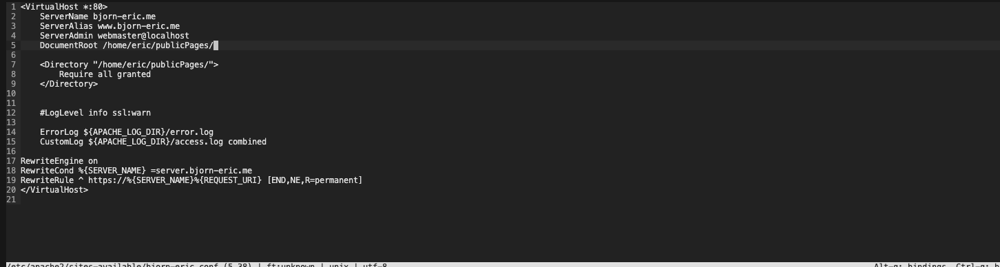

Tein kyseiseen hakemistoon virtuaali ympäristön pythonille ja aktivoin sen komennolla: `virtualenv -p python3 --system-site-packages ~/publicPages/env && source ~/publicPages/env/bin activate`

Loin seuraavaksi `reuirements.txt` tiedoston, johon listasin `django` paketin microlla ja asensin sen `pip install -r requirements.txt` komennolla. Testasin vielä lopuksi, että django asentui oikein ajamalla `django-admin --version` komennon. Django versioksi tuli `5.5.1`.
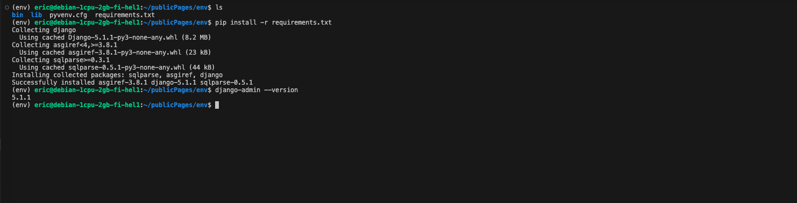

Seuraavaksi aloitin uuden django projektin komennolla: `django-admin startproject app` ja tarkistin, että projekti tuli luotua: 
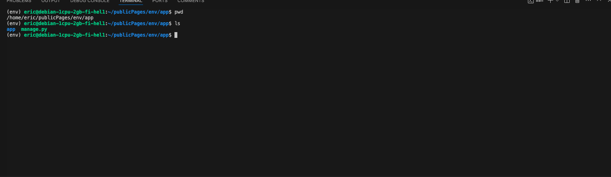

Seuraavaksi asensin ohjeiden Tero Karvisen ohjeiden mukaan apahce modin `mod_wsgi`. Asensin kyseisen moduulin komennolla `sudo apt-get -y install libapache2-mod-wsgi-py3`. Tämän jälkeen kopioin vielä Tero Karvisen ohjeista apache virtual host konfiguraation ja vaihdoin oikeat hakemistot:
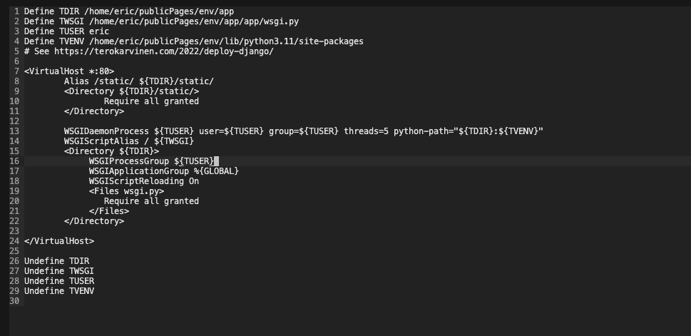

Tämän jälkeen testasin, että konfiguraatio on oikein tehty komennolla `/sbin/apache2ctl configtest`:
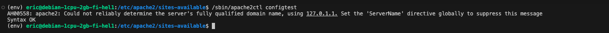

Tämän jälkeen käynnistin palvelimen uudestaan ja yritin varmistaa, että sivu toimii:
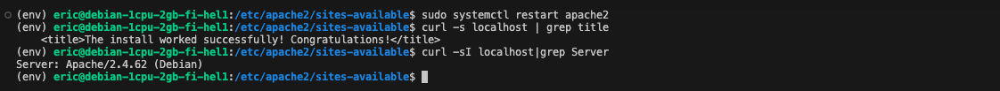

Tämän jälkeen disabloin Djangon DEBUG tilan ja käynnistin palvelimen uudestaan komennolla `sudo systemctl restart apache2`:
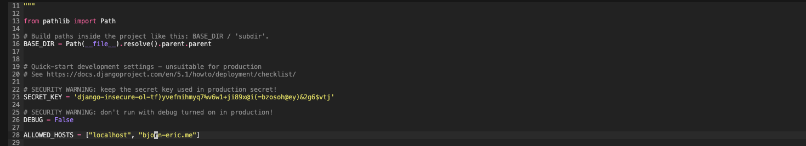

Seuraavaksi testasin näkyykö tekemäni muutos komennolla `curl -s localhost|grep title` ja muutos näkyy niinkuin pitääkin:
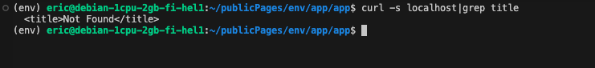

Tämän jälkeen yritin saada staattiset resurssit (css yms.) näkyviin asettamalla oikean polun python asetuksiin:
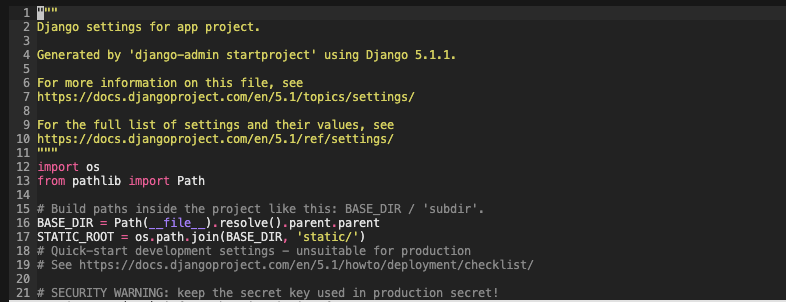
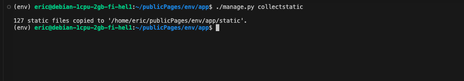
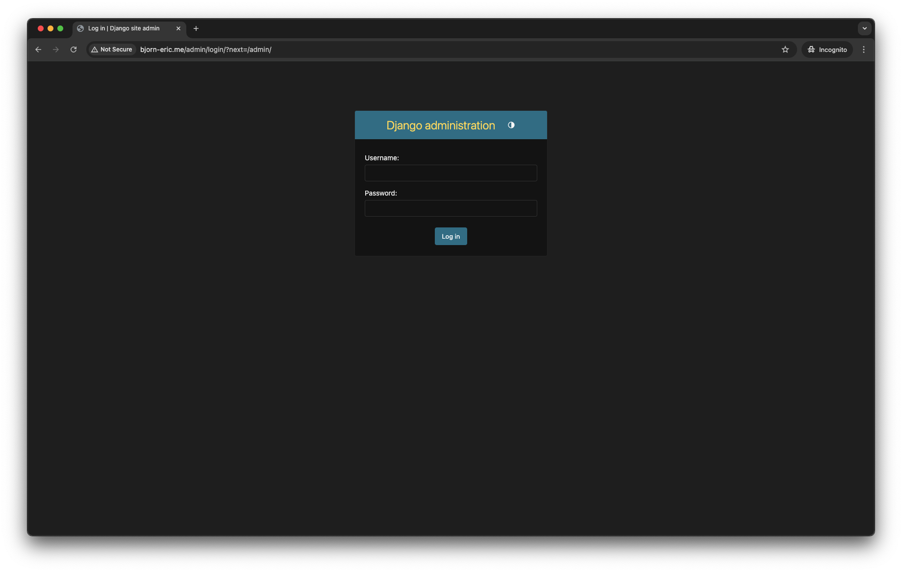

Lopulta loin uuden admin käyttäjän `./manage.py createsuperuser` komentoa käyttäen, mutta sain vastaavan virheilmoituksen:
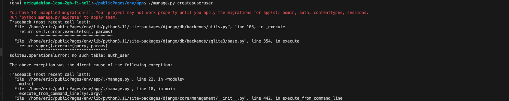

Virheilmoituksesta päätellen minulla oli jäänyt migraatiot ajamatta, joten päätin ajaa komennon: `python manage.py migrate` ja tämän jälkeen ajoin uudestaan komennon `./manage.py createsuperuser`. Loin uuden käyttäjän nimeltään `eric`.

Viimeiseksi kokeilin vielä varmuuden vuoksi käynnistää palvelimen uusiksi komennolla: `sudo systemctl restart apache2`. Lopuksi kokeilin vielä kirjautua sisään äskettäin luomillani tiedoilla ja onnistuin krijautumaan sisään: 

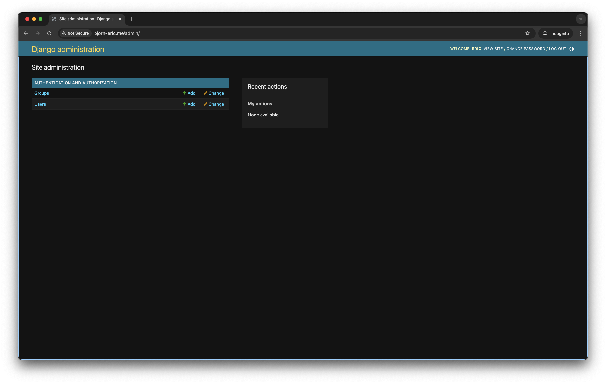

### Lähteet
https://terokarvinen.com/2022/django-instant-crm-tutorial/

https://terokarvinen.com/2022/deploy-django/

https://www.w3schools.com/django/django_getstarted.php

https://brew.sh/